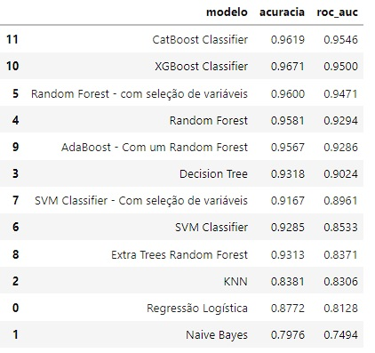

### Projeto - Prevendo Clientes Inativos

Base de dados utilizada foi retirada do site: https://www.kaggle.com/datasets/sakshigoyal7/credit-card-customers

Link do projeto: https://github.com/tharikf/Prevendo_Clientes_Inativos/blob/main/prevendo_clientes_inativos.ipynb

Neste projeto pretendemos prever o status do cliente dividido em duas classes, ativo e inativo. Cerca de 15,72% dos registros são classificados como clientes inativos. Portanto, temos um problema de classificação com classes desbalanceadas. Iniciamos com uma análise exploratória para compreender os dados. Posteriormente fazemos as transformações nos dados necessárias para obter melhor performance com os algoritmos de previsão. No pré-processamento utilizamos a transformação Robust Scaler que é robusta contra valores outliers. Além disso, realizamos o balanceamento de classes.

Os algoritmos e os resultados encontrados estão apresentados na tabela abaixo.

  

A partir deste Notebook construímos uma aplicação web para realizar previsões. O segundo Notebook, https://github.com/tharikf/Prevendo_Clientes_Inativos/blob/main/prevendo_clientes_inativos_deploy.ipynb, foi criado para preparar o modelo que será utilizado na aplicação. Optamos por utilizar o algoritmo Random Forest para construir a aplicação devido ao seu maior poder de explicação e bons resultados em acurácia e ROc-AUC. Os códigos para a construção da aplicação podem ser vistos em https://github.com/tharikf/webapp_cartao_cliente e a aplicação em funcionamento pode ser vista em https://status-cliente.onrender.com/.
